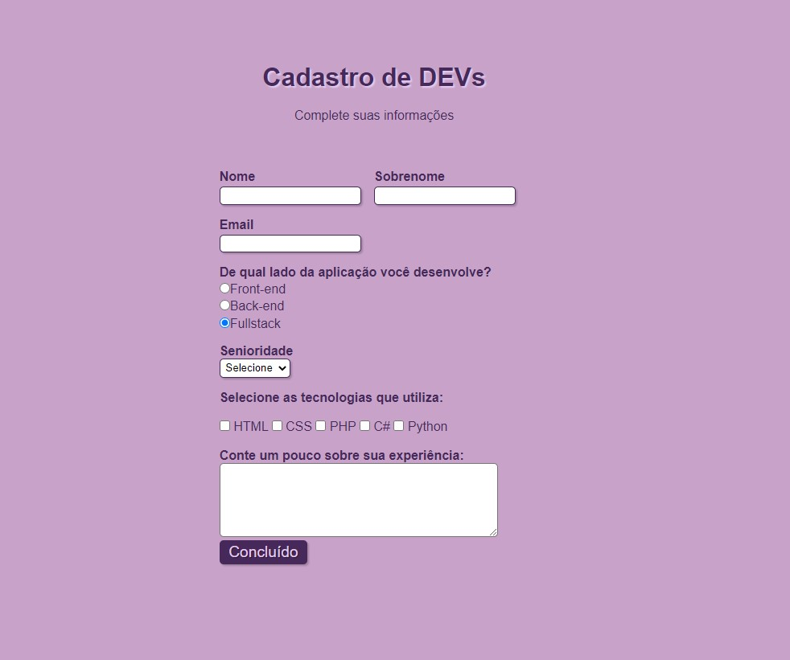

# Formulario_cadastro

Bem-vindo ao meu primeiro formulário 📄  
Neste projeto, me desafiei a criar um formulário atraente e funcional com várias opções de inputs.

## Tecnicas e ferramentas utilizadas
- ``HTML:`` Utilizei marcações semânticas para estruturar o formulário de maneira eficiente.
- ``CSS:`` Estilizei o formulário para proporcionar uma experiência visual agradável.
- ``VS Code IDEA:`` Para desenvolver e aprimorar o código.

